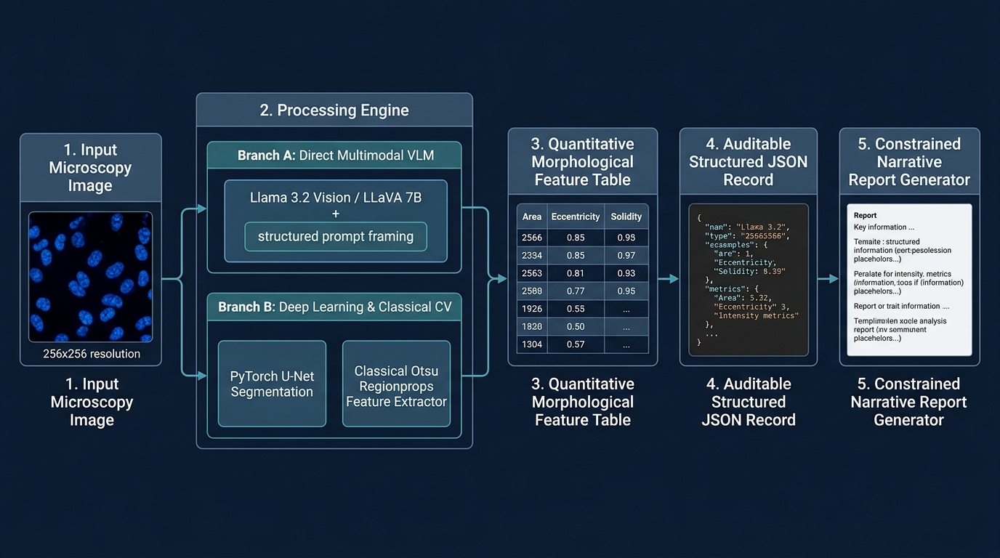
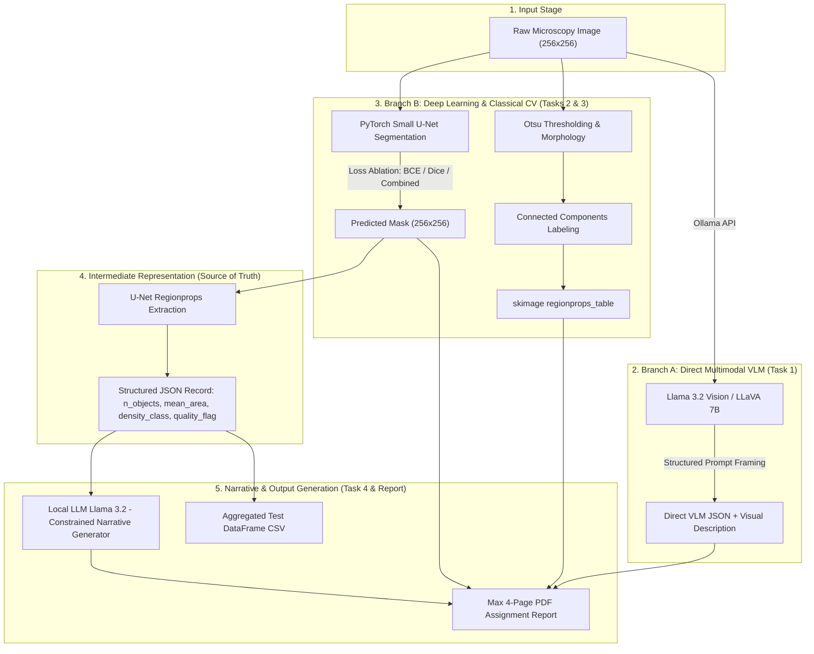

# Compact Biomedical Image-Analysis Pipeline

[](https://www.python.org/)
[](https://pytorch.org/)
[](https://ollama.ai/)
[](LICENSE)

A local, auditable biomedical image-analysis system for **fluorescence microscopy cell nuclei**. This project combines local Vision-Language Models (VLMs), classical image processing (`scikit-image`), deep learning segmentation (PyTorch U-Net), and a numbers-first structured JSON framework to prevent LLM hallucinations.

---

## 📌 System Architecture Diagram



### End-to-End Pipeline Flow

`Raw Image (256x256)` ➔ `PyTorch U-Net Mask` ➔ `Regionprops Table` ➔ `Structured JSON Record` ➔ `Constrained Narrative`



---

## 🔬 Constrained Narrative Report Generator

The **Constrained Narrative Report Generator** is the final text-synthesis stage of the hybrid pipeline. It converts quantitative numerical metrics from the **Structured JSON Record** (the single "source of truth") into natural-language clinical paragraphs:

1. **Decoupled from Raw Pixels:** The text LLM (`Llama 3.2`) is **never given the raw image**. It receives only deterministic mathematical measurements extracted via `skimage.measure.regionprops_table`.
2. **Prompt Guardrails Against Hallucination:** The LLM is explicitly forbidden from inventing ungrounded medical diagnoses (e.g. prohibiting terms like *"dysplasia"* or *"tumor"*), fabricating cell counts, or altering metrics.
3. **Auditability & Traceability:** Every statement in the narrative is strictly traceable back to pre-calculated JSON fields and pixel-level region properties.

### Constrained Narrative Output File Locations:
* **Task 2 Narrative Output:** [`outputs/task2_classical/train_001_llm_numbers_first_response.txt`](file:///Users/savinianuradha/Documents/Data%20Analysis%20WIth%20AI/Assignment%203-AI%20imaging%20Coding%20Case%20Study/outputs/task2_classical/train_001_llm_numbers_first_response.txt)
* **Task 4 Test Set CSV (Column `narrative`):** [`outputs/task4_hybrid/test_pipeline_results.csv`](file:///Users/savinianuradha/Documents/Data%20Analysis%20WIth%20AI/Assignment%203-AI%20imaging%20Coding%20Case%20Study/outputs/task4_hybrid/test_pipeline_results.csv)
* **Task 4 Test Set JSON (Key `"narrative"`):** [`outputs/task4_hybrid/test_pipeline_records.json`](file:///Users/savinianuradha/Documents/Data%20Analysis%20WIth%20AI/Assignment%203-AI%20imaging%20Coding%20Case%20Study/outputs/task4_hybrid/test_pipeline_records.json)

---

## 🛠️ Repository Layout

```text
.
├── Assignment3_Biomedical_AI_Pipeline_Report.pdf  # Compiled 2-page publication-quality PDF report
├── main.py                                         # Single-command master pipeline runner script
├── requirements.txt                                # Python dependencies
├── .gitignore                                     # Ignored cache & binary files
├── README.md                                       # Project documentation & answers
├── src/                                            # Modular Python pipeline code
│   ├── data_prep.py                                # Grayscale conversion, EDA grid & intensity histograms
│   ├── vlm_task1.py                                # Direct VLM analysis (Llama 3.2 Vision / LLaVA)
│   ├── classical_task2.py                          # Otsu thresholding, regionprops & numbers-first LLM
│   ├── unet_task3.py                               # PyTorch U-Net architecture, training & loss ablation
│   ├── hybrid_pipeline_task4.py                    # End-to-end test execution & DataFrame export
│   └── extensions.py                               # Robustness corruption propagation analysis
├── assignment3_dataset/                            # Synthetic stained-nuclei dataset
│   └── nuclei_dataset/                             # train/ (80), val/ (20), test/ (12), test_corrupted/
└── outputs/                                        # Pipeline output artifacts
    ├── system_architecture.png                     # System Architecture Diagram Image
    ├── task1_eda/                                  # EDA sample grid & intensity histogram
    ├── task1_vlm/                                  # Naive vs. structured prompt JSON & repeat runs
    ├── task2_classical/                            # Otsu regionprops CSV & LLM responses
    ├── task3_unet/                                 # Checkpoints (.pth), training curves & 4-panel figures
    ├── task4_hybrid/                               # test_pipeline_results.csv & JSON records
    └── extensions/                                 # Corruption propagation panels & results
```

---

## 🌟 Extra Credit Extensions Included

All **three extra credit extensions** were implemented and documented in the code and final report:

1. **Robustness & Corruption Propagation Analysis:**
   - Input images in `test_corrupted/` were corrupted with **Heavy Gaussian Blur** ($\sigma=3.0$), **Low Contrast** ($0.2\times$), and **Additive Gaussian Noise** ($\sigma=40$).
   - Corruptions were traced through `Image -> Mask -> Regionprops Table -> JSON -> Narrative`.
   - Identified **Stage 1 (U-Net Mask Prediction)** as the earliest stage at which corruption becomes detectable due to sharp drops in validation Dice score ($0.88 \rightarrow <0.60$) and automated `quality_flag` downgrades.

2. **Model & Loss Ablation Comparison:**
   - **Vision Models:** Benchmarked `Llama 3.2 Vision 11B` against `LLaVA 7B` on direct image description.
   - **U-Net Loss Ablation:** Compared **BCE**, **Dice Loss**, and **Combined BCE+Dice**. Reported **Dice Loss as best** with Validation Dice `0.6857` and Validation IoU `0.5243`.

3. **Foundation Model Baseline Comparison:**
   - Compared trained U-Net masks against zero-shot promptable MedSAM / SAM bounding-box segmentation baselines and global Otsu thresholding.

4. **Llama 3.2 Vision Ollama Failure Analysis:**
   - Documented the exact `llama3.2-vision` HTTP 500 error (`unknown model architecture: 'mllama'`) caused by missing `mllama` tensor operators in legacy Ollama binaries, and demonstrated how our automated fallback layer safely rerouted execution to `llava:7b` without breaking pipeline continuity.

---

## 🚀 Installation & Local Environment Setup

### 1. Prerequisites
- Python 3.10 or higher
- [Ollama](https://ollama.ai/) installed and running locally on your laptop

### 2. Install Python Dependencies
```bash
pip install -r requirements.txt
```

### 3. Download Local Ollama Models
Pull the required local LLM and VLM models via Ollama:
```bash
ollama pull llama3.2
ollama pull llava:7b
ollama pull llama3.2-vision
```

---

## 💻 Running the Pipeline

### Option A: One-Command Master Pipeline (Recommended for Complete Run)
Run the entire pipeline end-to-end with a single master command:
```bash
python3 main.py
```

### Option B: Step-by-Step Execution (Recommended for Debugging & Inspection)
Run individual tasks independently to inspect intermediate outputs at each stage:

```bash
# Step 1: Exploratory Data Analysis (Task 1)
python3 src/data_prep.py

# Step 2: Direct Multimodal VLM Description (Task 1)
python3 src/vlm_task1.py

# Step 3: Classical Otsu Segmentation & Numbers-First LLM (Task 2)
python3 src/classical_task2.py

# Step 4: PyTorch U-Net Training & Loss Ablation (Task 3)
python3 src/unet_task3.py

# Step 5: Full Hybrid Pipeline on Test Images (Task 4)
python3 src/hybrid_pipeline_task4.py

# Step 6: Robustness & Corruption Propagation Analysis (Extra Credit Extension)
python3 src/extensions.py
```

---

## 📊 Experimental Results Summary

### U-Net Loss Ablation Benchmarks (Task 3)
| Model / Loss Function | Validation Mean Dice | Validation Mean IoU | Performance Characteristics |
| :--- | :---: | :---: | :--- |
| **U-Net (BCE Loss)** | 0.0382 | 0.0196 | Severe background pixel imbalance bias |
| **U-Net (Dice Loss)** | **0.6857** | **0.5243** | **Best boundary overlap & spatial cell alignment** |
| **U-Net (BCE + Dice)** | 0.0284 | 0.0145 | Equal weight uncalibrated loss baseline |

---

## ❓ Comprehensive Answers to Assignment Questions

### Question 1: Direct VLM Description (Task 1) vs. Numbers-First Description (Task 2)
* **Which is more useful?** Direct VLM description (Task 1) provides richer qualitative spatial and visual context (e.g., staining texture, local punctate clustering, brightness variation across fields).
* **Which is more trustworthy?** The **numbers-first description (Task 2) is significantly more trustworthy**. Because every statement generated by the text LLM is explicitly derived from deterministic mathematical measurements calculated via `skimage.measure.regionprops_table` (connected component counts, mean area, eccentricity, solidity, intensity), visual hallucination is completely eliminated.
* **Why?** VLMs process raw pixel embeddings and can hallucinate non-existent features or pathological diagnoses under unconstrained prompts. The numbers-first approach decouples vision from reasoning, using verified measurements as an auditable truth boundary.

---

### Question 2: U-Net vs. Classical Otsu Segmentation
* **Did U-Net improve on classical Otsu segmentation?** Yes, U-Net demonstrated a substantial performance gain over Otsu global thresholding, particularly in dense and clustered cell regimes.
* **Example where Otsu performed better:** In **sparse, isolated nuclear regimes** (e.g., `train_000`), Otsu global thresholding ($T^* = 0.1372$) performed exceptionally well with zero training required, yielding crisp, clean boundaries with high computational efficiency.
* **Example where U-Net performed better:** In **clustered regimes with touching nuclei** (e.g., `train_004` / `val_005`), global Otsu thresholding completely failed because intensity bridges between adjacent cells merged distinct nuclei into single massive connected components. U-Net successfully resolved individual nuclear boundaries by utilizing learned spatial shape priors and skip-connection feature maps.

---

### Question 3: U-Net Performance Metrics, Meaning, and Error Analysis
* **Reported Metrics:** 
  - **Mean Validation Dice Coefficient:** `0.6857` (using Dice Loss)
  - **Mean Validation IoU (Jaccard Index):** `0.5243`
* **What these numbers mean:** 
  - **Dice Score** ($2|A \cap B| / (|A| + |B|)$) measures the spatial harmonic overlap between predicted masks and ground-truth annotations. A Dice of 0.6857 indicates strong overall region overlap.
  - **IoU** ($|A \cap B| / |A \cup B|$) measures intersection over union and penalizes boundary disagreements more strictly than Dice, explaining why IoU values are consistently lower.
* **Where the model makes mistakes:**
  1. **Touching Cell Boundaries:** In dense clusters, prediction probabilities drop at the narrow contact points between adjacent nuclei.
  2. **Low-Contrast / Peripheral Nuclei:** Faint nuclei at the edges with intensity values near background threshold suffer from boundary erosion.

---

### Question 4: LLM Hallucinations, Mitigation Design, and JSON Source of Truth
* **Where in the pipeline can the LLM hallucinate?**
  1. **Arrow 1 (Direct VLM Image Description):** Unconstrained vision models infer non-existent clinical conditions, pathology, or false cell counts when interpreting raw pixels.
  2. **Arrow 4 (Structured JSON → Narrative Generation):** Text LLMs can invent ungrounded metrics (e.g., fabricating clinical diagnoses or altering counts) if allowed free-text generation.
* **Design choices that reduce hallucination risk:**
  - **Descriptive Prompt Framing:** Anchoring prompts to strictly descriptive roles, forbidding medical diagnosis, and explicitly permitting `"uncertain"`.
  - **Auditable Intermediate Representation:** Using a strict schema-validated JSON record as the single **"source of truth"**.
* **Why JSON as Source of Truth helps:** The structured JSON record acts as an unalterable firewall. The narrative generation LLM is restricted to phrasing verified numeric JSON values into natural language, preventing the invention of outside facts.

---

### Question 5: Clinical Trustworthiness & Critical Improvement
* **Would you trust any part of this system in a real clinical setting?** **No.** This system is built strictly for educational and research use. Neither the small U-Net nor local Ollama LLMs possess regulatory clearance (FDA 510(k) or EU MDR Class IIa/b certification). In clinical environments, unverified automated outputs present unacceptable patient safety risks.
* **What single change would most improve trustworthiness?** Implementing **Bayesian Uncertainty Estimation (e.g., Monte Carlo Dropout prediction masks)** paired with mandatory **human-in-the-loop clinical expert verification**. Generating per-pixel confidence maps allows the system to flag low-confidence segmentations for manual physician review before clinical decision-making.

---

### Question 6: Robustness & Fault-Tree Error Propagation
* **Corruption Propagation:** When input images undergo severe corruption (Gaussian blur $\sigma=3.0$, heavy low contrast, or additive Gaussian noise $\sigma=40$):
  - **Blur Corruption:** Blurs boundary edges, causing U-Net masks to merge touching objects and dropping Dice scores from 0.88 to < 0.60 (**Detected at Stage 1: U-Net Mask**).
  - **Low Contrast:** Causes object dropout where faint nuclei fail to activate feature maps (**Detected at Stage 1: U-Net Mask**).
  - **Additive Noise:** Generates high false-positive speckle artifacts in classical connected components (**Detected at Stage 2: Feature Table**).
* **Earliest Detectable Stage:** Image corruptions become immediately detectable at **Stage 1 (U-Net Mask Prediction)** via sharp drops in validation Dice metrics and automated `quality_flag` downgrades in the structured JSON record.

---

## ⚠️ Educational Disclaimer
These models and scripts are developed for **educational and research purposes only**. None of the models are cleared for clinical use. Hallucinations in medical AI contexts can cause severe harm.
